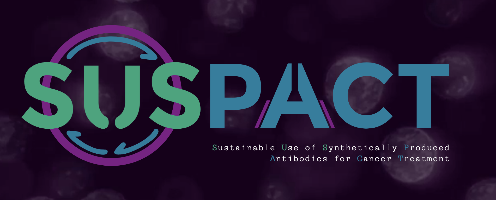

# iGEM RPTU Kaiserslautern 2025 Wiki

Portfolio mirror of the website developed for the **RPTU Kaiserslautern iGEM 2025 team**.

The website presents the team's iGEM project, research, results, human practices, education activities and other competition deliverables.

## Live Website

The final competition website is publicly available here:

[Live Website](https://2025.igem.wiki/rptu-kaiserslautern/)
[](https://2025.igem.wiki/rptu-kaiserslautern/)

I was responsible for the **technical development and implementation of the website**.

My work included:

* Frontend implementation
* Website structure and page layouts
* HTML, CSS and JavaScript development
* Navigation and interactive elements
* Integration of the team's content into the website
* Integration of graphical assets
* Integration with the iGEM Frozen-Flask wiki system
* Technical preparation of the website for the iGEM deployment environment

The **scientific and project-related written content** was created by the iGEM team.

The **graphical artwork and design assets** were created by the team's designer.

Except for the supplied textual content and graphical assets, I was responsible for the website's technical implementation.

## Technologies

* HTML
* CSS
* JavaScript
* Python
* Flask
* Frozen-Flask
* Bootstrap
* Jinja templates

## Repository Structure

```text
.
├── static/               # CSS, JavaScript and static website assets
├── wiki/
│   ├── pages/            # Individual wiki pages
│   ├── layout.html       # Main page layout
│   ├── menu.html         # Navigation
│   └── footer.html       # Shared footer
├── app.py                # Local Flask application
├── dependencies.txt      # Python dependencies
├── LICENSE
└── README.md
```

## Running Locally

Create a Python virtual environment:

```bash
python3 -m venv venv
source venv/bin/activate
```

Install the dependencies:

```bash
pip install -r dependencies.txt
```

Start the local development server:

```bash
python app.py
```

## About This Repository

This GitHub repository is a **portfolio mirror** of the website I developed for the RPTU Kaiserslautern iGEM 2025 team.

The original project was developed and deployed using the official iGEM infrastructure. Deployment-specific GitLab CI configuration is not included in this portfolio mirror.

## Attribution

This website was created as part of a collaborative iGEM team project.

Website implementation and technical development were performed by the repository owner.

Scientific texts and project content were created collaboratively by the RPTU Kaiserslautern iGEM 2025 team.

Graphical artwork and design assets were provided by the team's designer.

## License

The iGEM website content is licensed under the **Creative Commons Attribution 4.0 International License**.

The original license file is retained in this portfolio mirror.
